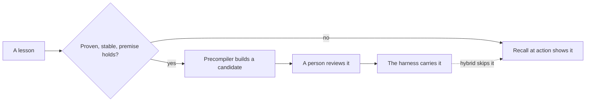

Interpretive mode shows lessons when an agent acts. Precompiled mode builds lessons into the harness ahead of time. Hybrid mode does both, and it is the aim.

A lesson can reach an agent in two ways. Recall can find it and show it at the moment the agent acts. Or the precompiler can build it into the harness before the agent starts. It becomes a guard, a skill, a subagent or a line in an instruction file. The first way is interpretive. The second is precompiled.

## Why it exists

Neither way is best for everything.

- **Interpretive** adapts at once to a new lesson. But it costs context on every action, and it only helps when the agent is about to act.
- **Precompiled** is cheap when the agent runs, and it stops a mistake before it starts. But it is slow to change, and it can go stale when its lesson changes.

So the aim is "most but not all" precompiled. Interpretive recall stays as the safety net for the rest.

## How it works

One setting picks the mode: `AKASHIC_MEMORY_MODE`. You set it per harness, in that harness's settings. When it is unset, the mode is interpretive, so nothing changes until you choose.

| Mode | What recall at action and boot push |
| --- | --- |
| `interpretive` | Every lesson that fits, as today. |
| `precompiled` | Nothing. The harness carries the lessons. |
| `hybrid` | Every lesson that fits, except those compiled into this harness. |



The precompiler builds each chosen lesson into a candidate harness. A person reviews that candidate before it lands. When it lands, each compiled lesson gets a mark that says where it lives. In hybrid mode, [recall at action](/docs/concepts/memory/recall-at-action) reads that mark. It skips the lesson in the harness that already carries it. So no lesson is both built in and pushed in the same harness.

### Choosing the mode with evidence

The meta-harness compares four arms on the same replayed tasks, with the same model and the same number of trials:

1. **Bare:** no memory at all.
2. **Interpretive:** lessons shown at action.
3. **Precompiled:** lessons built into the harness, nothing shown.
4. **Hybrid:** built in where compiled, shown for the rest.

The report gives each arm's pass rate, tokens, time and cost, with error bars. It picks the default mode by the best pass rate first. Among modes that can't be told apart from the best, it picks the one that uses the fewest tokens.

### Moving single lessons

Each lesson can move between modes on its own evidence.

- **Compile** a lesson when it is proven, its scope is stable, and its premise still holds.
- **Demote** a compiled lesson when nothing ever uses its pieces.
- **Recompile** a compiled lesson when someone edits it, the curator benches it, or a replay finds it wrong. Any such change flags its pieces and queues a new build.

## How you use it

```bash
uv run agent_cli.py modes show
uv run agent_cli.py modes placement
uv run agent_cli.py modes stale
uv run agent_cli.py modes compare --base baseline --compiled <candidate> --scenario <id> --daily-usd 5
```

`modes compare` runs real agents, so it needs a spend cap.

## Don't confuse

- **Execution mode** vs **scope.** Scope says where a lesson applies: which harness, model or effort. The mode says how a lesson that applies reaches the agent.
- **Precompiled** vs **graduated.** Some automation enforces a graduated lesson, so recall leaves it out everywhere. A compiled lesson lives in one harness's files, and only that harness skips it.

## How it connects

- **Built on:** [Lessons](/docs/concepts/memory/lessons), [Recall at action](/docs/concepts/memory/recall-at-action), [Boot](/docs/concepts/memory/boot)
- **Used by:** [Recall at action](/docs/concepts/memory/recall-at-action) and [Boot](/docs/concepts/memory/boot), which skip compiled lessons in hybrid mode
- **Part of:** [Memory and recall](/docs/concepts/memory)
