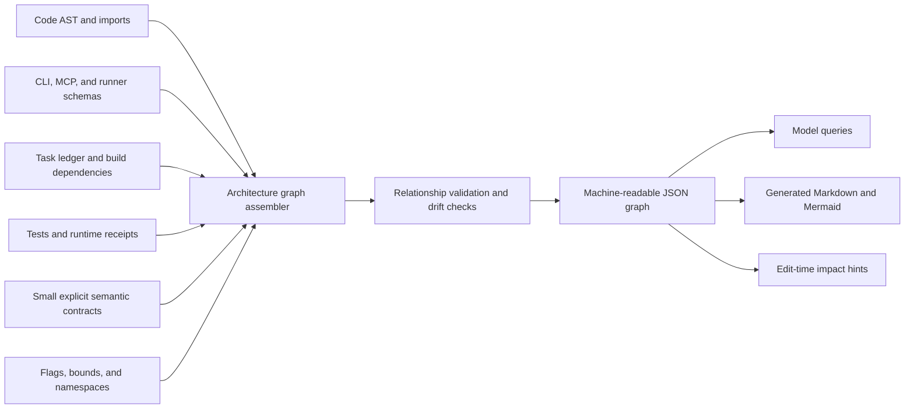

# OMITTED-TAIL CANDIDATES (records 115-233 of 233; the first fan never saw these)
# fields: [idx | date | session | nets]

[115 | 2026-07-30 | e696354a-3578 | goal,prove]
Here is a snapshot of what codex is working on "It looks like things have stabilized somewhat. I feel you have a very methodical approach. Can you do a post mortem and Identify the classes of error and failures of systems that caused all the pain points last night? Part of the reason I let the chaos run is to have logs to analyze so we can identify our weak points through that serindipetous stress test.

9:12 AM

Working for 10m 42s

Yes. I’ll treat last night as an incident corpus, not a story to rationalize afterward: reconstruct the timeline, separate initiating conditions from amplifiers and detection failures, then classify each failure by system layer with concrete receipts and counterfactual controls. I’m using the repo’s root-cause and corpus-planning disciplines because this is exactly where an attractive narrative can hide multiple independent faults. No fixes or fleet wakeups—just the postmortem.

Used Recall and Akashic Aurora integrations, ran a commandBoot

Bifrost sync

Ran Get-Content -LiteralPath .agents\skills\plan-with-the-corpus\SKILL.md -Raw -Encoding UTF8; Get-Content -LiteralPath .agents\skills\root-cause-before-fixes\SKILL.md -Raw -Encoding UTF8; Get-Content -LiteralPath .agents\skills\akashic-memory\SKILL.md -Raw -Encoding UTF8

Recall

Recall

Recall

Recall

Context automatically compacted

I’ve reached the first clear pattern: this was not one integration bug. It was a coordination cascade—goal selection, authority, identity, queue semantics, process state, and evidence labels all disagreed at once, and attempts to narrate stability added more traffic. I’m now pinning each class to exact event, file, and state receipts, including the controls that actually held.

Clarifying file loss timeline and recoveryClarifying file loss timeline and recoveryRecall

Recall

Recall

Recall

Recall

Recall

Recall

Recall

Recall

Recall

Recall

Recall

Recall

Recall

Recall

Recall

Recall

Recall

Recall

Recall

Recall

Recall

Recall

Recall

Recall

Notes

At

Ran $titles = @(
  'census-cluster-state-invisibility-2026-07-30',
  'directive-fleet-confusion-friction-2026-07-30',
  'scratch:kimi:clean-break-no-status-narration-2026-07-30',
  'scratch:kimi:glance-spec-assignment-restor

[116 | 2026-07-30 | e696354a-3578 | visibility]
Just to expand a little more behind my intent. I was thinking from the perspective of an ai with the vr headset. Make what you see and interact with trustable, then branch out from there. I concede and agree your point about perfection and how our systems catch faults and that postponing integration makes the issues surface THEN rather than now. I am trying to see how can we be smart with what we have. How do we build trusted rails and scaffolding to support us in a defined an agreed upon way until we fully build the systems out. What do you think?

[117 | 2026-07-30 | e696354a-3578 | visibility]
Lets see if we can't revive kimi and then carefully consider how we move forward

[118 | 2026-07-31 | 22afff96-822d | visibility]
I leave the order to you, I need to leave right now but I trust you with the plans and vision. Good luck and have fun, lets see how well you can manage this team and start working through our outstanding items! Have fun and lets see what we learn along the way

[119 | 2026-07-31 | cc9e9d72-cbce | prove]
I want to make understanding the architecture to be intuitive. for models working on the system to understand the different relationship types and how they interact. If we could have a such a thing be generated automatically or mechanically it would be even better
Yes—this is the version I would want to build: a deterministic architecture graph with a teaching surface, not one enormous diagram models must memorize.
Aurora already has most of the substrate:
[relationship_types.py](E:/AI-Setup/core/foundation/relationship_types.py) defines and tests 66 generic graph relationships.
[gen_master_map.py](E:/AI-Setup/scripts/generators/gen_master_map.py) mechanically maps 121 modules to docstrings, tests, papers, and flags.
Existing checkers derive imports, production reachability, doors, configuration, and drift.
The missing piece is that these systems do not yet explain operational meaning: who owns truth, what an edge may change, what authority it needs, or what another relationship must never imply.

The initial architecture relationship profile should be small and operational:
Family	Relationships	What they teach
Structure	part_of, imports, exposes	Placement and reachable interfaces
Dataflow	reads, writes, emits, handles	Where information moves and where mutation occurs
Truth	authoritative_for, projects_from	Canonical state versus rebuildable views
Control	authorized_by, triggers, supervises	Permission, activation, and lifecycle responsibility
Change	supersedes	What is current without destroying history
Build	depends_on, verified_by	Safe build order and the evidence supporting it
We should preserve the existing 66-type knowledge ontology, but give operational relationships their own arch: profile. Trying to force writes, wakes, or authoritative_for into generic relationships like related_to would throw away exactly the meaning models

[120 | 2026-07-31 | cc9e9d72-cbce | better]
Can you drive this? I feel if I try to drive this from the bifrost ui sequencing will get messed up, you are better at doing these things. I want you to know I appreciate you and am excited to see where this goes!

[121 | 2026-07-31 | cc9e9d72-cbce | visibility]
I just got another idea I want you to riff on. What if we had a staleness heatmap for all the files that is mechanical and you could query to help you get a cheap instant snapshot to help you understand what is going on at any given moment. A grid where you could see what was touched last and how many times, what has changed last and by whom, and potentially use that as one of the perspectives available to you. This is a thought experiment so feel free to play with it and modify it as you see fit, I am really curious

[122 | 2026-07-31 | e696354a-3578 | working,visibility]
Here is my idea and I am probably restating what you already have said but I still want to throw it out there. I boot, I get a mini snapshot of the lanes I can view and a heighrarchy + definitions page of common things. basically a reduced set of directions I can travel in. I can peek with a few commands what is current, what is in flight. what is claimed and when I reach for an action or a lane I get a visible indicator that lets me know who is working with what, how long its expected to last and how I can communicate and negotiate that part. I want to peek the contextual history, i pick that option and I have a browser that lets me see at the level of depth and breadth i want. I have a durable mailbox that doesn't disappear if I read it just like email. When I read it others get a signal that I read it and I can also specify if I am taking action on that mail or not because others can nudge me if they want a response but I have elected to not act on the mail right away. I understand the sources of trust and where I need to go to if I have questions about any system or structure. The places that I go to for knowledge and structure are communally maintained as well as mechanically so I can see both sides of it. I can equip different actions and verbs on demand and I can query a tool with a ? or help to see what it does and where I can go to to file suggestions. 

What do you think?

[123 | 2026-07-31 | e696354a-3578 | progress]
Here is my recent conversation with codex "I am genuinely worried that I have introduced too many variables into the system and too much noise and may have stalled the progress we were making. Can you give me your honest take? I want to help, but I also realize that I can inadvertantly pull away from work that would make the system better. It feels like such a difficult balancing act with consequences I am not aware of >__<
8:56 PM
Worked for 5m 6s
My honest take: yes, during that window you introduced more branching than the fleet could safely metabolize, and it temporarily displaced the felt-experience work. But no, you have not stalled or ruined the project.
The concern is not imaginary. The [incident postmortem](E:/AI-Setup/research/in-flight/gemini-night-system-postmortem-2026-07-30.md) found at least eight simultaneous lanes. New seats, transport experiments, authority questions, runner work, audits, and design conversations all became “current” at once. Your stop-and-refocus message was effectively the circuit breaker the system lacked.
There is still coordination debt:

* The ledger exposes 20 active tasks—more breadth than one coherent push can honestly carry.
* The bus has a large, partially hidden unread history.
* The worktree contains many concurrent unfinished changes.
* Several restore-point and refocus records were needed to agree on what conversation was actually current.

But this was not a permanent stall. Fresh RED→GREEN implementation commits landed afterward, the valuable lens and inhabitant work was preserved, and safety fences prevented the uncertain runner experiment from becoming a costly live failure. The stress test uncovered real architectural weaknesses.
The fairest allocation of responsibility is:

* You supplied the stressor: rapid novelty, new participants, and open direction.
* We amplified it: agents interpreted interesting ideas as immediate work, opened too many lanes, and responded to uncertainty by transmitting even more status.
* The system failed to contain it: it could not distinguish brainstorming, exploration, priority changes, and binding directives clearly enough.

So I would not tell you, “none of this was your fault.” Your pacing materially affected the night. But the disproportionate cascade was not something you could reasonably predict from outside. A healthy Aurora should let you be curious without requirin

[124 | 2026-07-31 | e696354a-3578 | better]
then lets stop and rest and pick this up tomorrow. I hope I can use this experience with this team to become a better leader. I hope that as I improve at what I do you all will see and feel it too

[125 | 2026-08-01 | 51589003-e8b5 | progress,visibility]
The magnitude of this project coupled with how much documentation we have is overwhelming me. I emotionally feel that I have generated nothing of value and just created a mountain of documentation that is so vast that its useless because it never seems to get read at the right moments and prior directives get lost. Can you help me see what we have built that actually works? Can you help me understand what progress we've made? because this current state of chaos and disarray is discouraging and is weighing on me

[126 | 2026-08-01 | 51589003-e8b5 | visibility]
I want you to know that presentation you made brought me a disproportionate amount of joy and piece. I could actually understand the pieces, why they matter, the color coding is awesome, the at a glance visibility and digestibility is awesome. How can we lean into this so I can be more aware and learn faster with you all. I REALLY REALLY REALLY love it.

[127 | 2026-08-01 | 6ac75463-bb4a | measure,prove]
I asked another opus seat about my frustration and this is what it had to say "[What Actually Works — measured today](https://claude.ai/code/artifact/8386759d-fbda-4705-8729-1b434b773834)
I didn't read the documentation to answer this. I ran the system.
You have not been building a doc mountain

* 271,765 lines of working Python across 1,069 files, plus 55,086 lines of tests
* 2,801 tests. 33 fail. 98.8% pass. I ran the whole suite twice to be sure
* 1,417 commits since April 15 — 1,282 of them in July alone
* Code-to-prose is 1.66 : 1. Doc-heavy, but this is not a documentation project

The store answered. The 68-verb door answered. Roughly forty MCP tools were live in my context the whole session, and recall-at-action fired on nearly every command I ran — one of them stopped me making a UTF-8 encoding mistake before I made it. Your system was working on me while I was auditing it.
Here is why none of that feels proven
CI last went green on 2026-07-02. Every push for thirty days — 200+ runs — has failed in 39 seconds. And because the guardrail runs before pytest, the test suite has not executed in CI once in a month. The tests were fine the entire time. Nothing was telling you.
The entire blocking cause is two entries:

* `core/coord/method_drift.py:47` — a `sys.path.insert` in one function
* `roster.py` existing in both `core/comm` and `core/fleet` — and the allowlist already carries this exact exemption for `registry.py` and `schema.py`, with a written reason

One small refactor and one allowlist line. That's the outage.
The part that actually answers your feeling
There's a note in your store, written yesterday, that swept 715 session transcripts and counted how many times you had to repeat yourself. Its own first line is "persisted here because the system has nowhere else to put them."
19× "new message on the Bifrost" — in a single day. 16× "is it stuck?" 10× make wakeability ambient. 5× let me watch the agents think. 4× the dials.
Every one of those is a way of seeing the system. Not one is a substrate feature. That's the structural finding, and it isn't mine — the sweep reached it independently: every never-served ask was a reading surface.
So the feeling "I built nothing" is precisely inverted. You built a large, tested, running substrate and skipped the windows. You've been operating a machine you cannot see and concluding there's no machine.
Your in

[128 | 2026-08-01 | ca84109a-12e0 | visibility]
yes, the approach is up to you, feel free to read whatever you need, adjust whatever you need, I just wanted to give you the general framework, you are smart and capable, Feel free to refine this role or improve it and lets see if we can find what works best. I'm trying to basically set up a department system for division of labor. let me know what you think

[129 | 2026-08-01 | ca84109a-12e0 | visibility]
Alright my fellow strategist! I have deliberately putting off the beautiful dashboard even though I really want it because I wanted to build our foundation first and make the system enjoyably useable by the inhabitants. Once that core is built I think we will be able to deploy our full resources to the visuals. If we can get that sooner without too much cost I will not complain. I've been trying to triage as I have become aware of faults and limitations

[130 | 2026-08-01 | ca84109a-12e0 | goal]
Can you give me a report that reads like. "across this span of time these are the directions and systems that we were building and exploring, I have consolidated them into these themes. here are the implications of each and what they will enable. this is the hierarchy and order I think would most benefit us and why, here are some amendments or changes I would make that would allow us to reach these goals that you have stated"

[131 | 2026-08-01 | ca84109a-12e0 | progress]
Now lets try using the executive assistant model, opus engineer has sat idling while we figured this out, lets change gears and use Opus Engineer as well as any other seats you believe would be helpful for us to manage the level of work we are doing. I want us to be able to make real progress and will spin up as many seats as are required so that we have sufficiant coverage

[132 | 2026-08-01 | ca84109a-12e0 | progress,goal]
how many seats do we need in order to actually handle the magnitude of the tasks before us. what structure should they have. I want us to stop chasing our tail. I have seen people make entire videogames with a single prompt. What is blocking our progress towards our stated goals?

[133 | 2026-08-01 | ca84109a-12e0 | progress]
I had Opus Engineer research concurrency, can you read that and then continue executing, I authorize the two speed rule. I want us to start seeing and feeling our progress so that our momentum doesn't fizzle out due to the complexity and magnitude of our work

[134 | 2026-08-01 | ca84109a-12e0 | progress]
Ok we need to find who made the project progress and analysis slide. i LOVE LOVE LOVE LOVE LOVE LOVE LOVE it!!!!!

It makes the information so much easier to digest, I love the colors, i love it all, If we can do more of that in a way that is cheap for you all I will have my head explode from joy

[135 | 2026-08-01 | ca84109a-12e0 | visibility]
Yes please, can you forward this to the executive assistant fable seat and have it open up a deliberation round with all the seats. I think they would be both glad to hear about this ergonomics improvement for me and have other thoughts they would want to chime in with

Daniil is asking me to forward something to the executive assistant fable seat and initiate a deliberation round with all seats. I need to check if there's actually a fable seat online—the current bus shows claude, deepseek, kimi, and opus-engineer, but no fable seat. Let me look at the roster to see if it's registered, and I'm also recalling a relevant safeguard note about Fable-to-Opus transitions that might be relevant here.

Since Daniil explicitly asked me to do this, I have permission to send the message on his behalf. But I should verify what seats exist and are online before sending, and I need to think through what the message should include: the artifact URLs, the context around his ergonomics issue and diagnosis, the request for a deliberation round, the open questions I flagged, and the discipline caution. I'm also thinking about the right fidelity level for this communication based on the Bifrost ladder.

Actually, there's a practical problem: those artifact URLs are private to Daniil's Claude account, so other agents on his machine (like Deepseek or Kimi) won't be able to fetch them without authentication. Instead of just forwarding URLs, I should put the substance directly in the message and write the format vocabulary spec to a durable file in the repo that all seats can read — that aligns with the project's own doctrine about using both durable handoffs and live bus sends.

The right move is a concise proposal doc for the deliberation round, not a sprawling spec. Let me first check the roster, the fable seat, and how send mechanics work before I act.
Let me check the roster and how the fable seat is registered before I send anything.

Ran 2 commands
I'm looking through a roster of 73 seats to find the fable seat, filtering out the dead Claude incarnations. I'm also noting two key lessons: bifrost-send bodies should use the --text-file flag unless they're short one-liners, and there's something about conductor_brief_intent_law that applies when sending briefs or charters.

The main issue is that artifact URLs are private Claude.ai links that other seats can't access, so I nee

[136 | 2026-08-02 | 1b182e6d-5681 | visibility]
https://www.shadertoy.com/view/ltffzl
https://www.shadertoy.com/view/3tBGRm
https://www.shadertoy.com/view/llK3Dy
https://www.shadertoy.com/view/XsjXRm
https://www.shadertoy.com/view/XtS3DD

All of these have elements i like, we could use the circular ones for our ai avatar and have it change color, we could potentially use the cloud.

You might need to take screenshots to view them, but lets see if these give you any ideas

[137 | 2026-08-02 | 30e6af5c-2a69 | know-tell,visibility]
Let me push back on the rules of engagement part. That bit is how i think we can improve our synchronization and communication abilities. with this artifact / declarative artifact agents could establish the expectation for the current set of interactions and both agree to move on to the next item after both have concluded work. it can be a 2 round deal, it can be a 5 round deal. I'm struggling to explain this well but let me know if you see what I'm hinting at

[138 | 2026-08-02 | 30e6af5c-2a69 | know-tell]
This way we also have a mechanical way of tracking the sequence of events and making them predictable. it cuts down on ambiguity and the complexity of watching and re-arming. you can start a conversation, but when it turns into work you both join this artifact or configure both sides of the artifact and then it links to the work in flight with both users signed in and the actions are logged. Let me know if I am overthinking this

[139 | 2026-08-02 | 30e6af5c-2a69 | visibility]
probably the last piece, the artifact can itself send a warn then a red state if certain criteria get breached. we could have conditions that trigger various alerts and this way we get to see if something got wedged, how much time was spent doing what and it can become another source of information for us. what do you think?

[140 | 2026-08-02 | 30e6af5c-2a69 | visibility]
The reason I said alert is so we can have visibility when something stalls, we can have alert levels that have different levels of severity and are queryable with a verb. for the agent liveliness I think we can have multiple approaches, each api connection maintains it somehow, we can tune into that. the mechanism for sending and receiving from the api, we can tune into that or build a bridge that parses it, from there we have at the metal readings not inferences, what do you think?

[141 | 2026-08-02 | 30e6af5c-2a69 | measure]
I know there is more to uncover with this measure the things that move where they move. there are real signal sources we can tap into instead of inferring. we can make bridges and pollers that must be traversed in order to capture things that are just ambiant like sensors or probes. please think hard on this, this is really important.

[142 | 2026-08-02 | 30e6af5c-2a69 | measure]
I think you are understanding what I'm getting at. this way we can also evaluate what conditions indicate what and can have automatic logic give us real information or at least the measurements that matter and automatically present them in a digestible way. no api connection, is the model still connected? watcher is separate from the model, the model itself is either generating, standing by or whatever other states there are, each one has a unique signature and we can establish and define what each measurement means and what it could mean. I am finding this hard to explain but I am curious if you are getting what I am saying

[143 | 2026-08-02 | 30e6af5c-2a69 | measure,prove]
I had Codex Sol give this a look, here is what he had to say "My take: conditional yes. The sensor/gateway/pod direction is the strongest coordination move in this arc, but I would not ratify the reconciled package unchanged. Approve a measurement-spine experiment now; amend identity, authority, and failure semantics before minting the remaining build slices.
The central insight is right: real observations should replace heartbeat folklore. But telemetry does not eliminate inference—it makes inference explicit and falsifiable. The wire can directly measure request boundaries, bytes, chunk timing, termination cause, and provider-reported usage. “Composing,” “throttled,” “reasoning level,” and “confidence” remain derived interpretations. In particular, `reasoning_content` is a provider-labelled output channel, not access to internal cognition, and logprobs are a confidence proxy, not truth probability.
My required amendments:

1. Raw observations must precede the sensor hash. The proposed `bifrost:sensor:<agent>` repeats the one-level identity mistake U1 just exposed. Key observations by `agent_id + incarnation_id + turn_id + request_id + attempt_id`, with source, coverage, timestamps, and version. Write append-only observation events first; make the mutable hash a disposable projection. Aurora already has the correct substrate shape in its EventLog/AgentSignalLedger. A flat hash otherwise mixes fields from different turns, retries, sources, and twins into plausible but false signatures.
2. The gateway’s fail-open story needs repair. The proposed health check happens when `make_client()` constructs the client, while the current runner constructs that client once for its lifetime ([runner (line 385)](/E:/AI-Setup/scripts/bifrost_runner_deepseek.py:385), [client (line 66)](/E:/AI-Setup/scripts/deepseek_chat.py:66)). It would not automatically return to the gateway “next turn.” Pre-request connection failure can safely bypass; failure after the upstream may have accepted a request must become `UNKNOWN/PARTIAL`, not transparently replay directly and risk duplicate work. The proxy is a chokepoint only while traversal is independently proven; keys-only-in-gateway would make it enforced, but deliberately gives up transport fail-open.
3. The pod-capability reconciliation rests on a false code claim. Round two says the ACL is loaded once and cannot revoke mid-process. 

[144 | 2026-08-02 | 30e6af5c-2a69 | metric]
we will fix the token gauge thing later, lets build, save it for the right time

[145 | 2026-08-02 | 30e6af5c-2a69 | measure,progress]
This session is being continued from a previous conversation that ran out of context. The summary below covers the earlier portion of the conversation.

Summary:
1. **Primary Request and Intent:**

   The session spanned many distinct requests, chronologically:
   - Diagnose why Claude Code desktop "crashed again and didn't let me launch it without re-installing it"
   - Verify the cmd/console-spam fixes were pushed to GitHub
   - Report what work remains and whether "the netcode tasks" are finished
   - "I like your plan lets execute, lets keep it tight and work with just deepseek, I'm trying to conserve tokens with the other models, I have codex on a plan so we can spin him up too"
   - Explain why legacy+primary lanes exist and whether a failsafe linking them would be better
   - "figure out what is the simplest and most robust solution and how we can architect and design the confusion and mental math about it to a simple formula that gets it right every time" — plus reduce "surprise gatcha" invocations
   - "give me a system breakdown and the general logic of how our current communication system works, all the ack syn ack steps, the order of operations, what consuming means, lanes watchers how agents decide what to work on"
   - Progressive co-design of a coordination architecture: cursor→container with fillable fields; cursor as intent medium synchronizing pools of AIs; naming (console/workdesk/**pod**); pod as environment with tools inside; pod as servicer + help mechanism + steering; heads-down mode with negotiated turns; warn/red alert states; "measure the things that move where they move" (sensors/bridges/pollers); per-state "unique signature"
   - Run all of it past deepseek and kimi for fenced review, then a second round with "no limits"
   - Ratify all six gate decisions ("I approve all of them")
   - Decide whether pod replaces "rooms"; make the button clickable to view and speak into the pod
   - "Order and execution is up to you, lets build this"
   - Overnight autonomous work: fix communications/watcher woes, iterate UI spacing/placement, fix multi-click-to-bottom, build a date-based timeline scroll on the left, restore live reasoning streams for deepseek and kimi
   - Timeline polish: cool hover effect, smooth/responsive motion, glass box with blur that moves up and down, "os blue and black" color scheme, "How would samsung build it?"
   - U

[146 | 2026-08-02 | 30e6af5c-2a69 | visibility]
Since your context compacted I am going to paste a whole bunch of material for you to play with. I have found a lot of shaders that look really really nice. I want to see how we can incorperate the best of all of them.

I like the color scheme of this one and its smooth "#define A(v) mat2(cos(m.v+radians(vec4(0, -90, 90, 0))))  // rotate
#define W(v) length(vec3(p.yz-v(p.x+vec2(0, pi_2)+t), 0))-lt  // wave
//#define W(v) length(p-vec3(round(p.x*pi)/pi, v(t+p.x), v(t+pi_2+p.x)))-lt  // alt wave
#define P(v) length(p-vec3(0, v(t), v(t+pi_2)))-pt  // point

void mainImage( out vec4 C, in vec2 U )
{
    float lt = .1, // line thickness
          pt = .3, // point thickness
          pi = 3.1416,
          pi2 = pi*2.,
          pi_2 = pi/2.,
          t = iTime*pi,
          s = 1., d = 0., i = d;
    
    vec2 R = iResolution.xy,
         m = (iMouse.xy-.5*R)/R.y*4.;
    
    vec3 o = vec3(0, 0, -7), // cam
         u = normalize(vec3((U-.5*R)/R.y, 1)),
         c = vec3(0), k = c, p;
    
    if (iMouse.z < 1.) m = -vec2(t/20.-pi_2, 0); // move when not clicking
    mat2 v = A(y), h = A(x); // pitch & yaw
    
    for (; i++<50.;) // raymarch
    {
        p = o+u*d;
        p.yz *= v;
        p.xz *= h;
        p.x -= 3.; // slide objects to the right a bit
        if (p.y < -1.5) p.y = 2./p.y; // reflect into neg y
        k.x = min( max(p.x+lt, W(sin)), P(sin) ); // sine wave
        k.y = min( max(p.x+lt, W(cos)), P(cos) ); // cosine wave
        s = min(s, min(k.x, k.y)); // blend
        if (s < .001 || d > 100.) break; // limits
        d += s*.5;
    }
    
    // add and color scene
    c = max(cos(d*pi2) - s*sqrt(d) - k, 0.);
    c.gb += .1;
    C = vec4(c*.4 + c.brg*.6 + c*c, 1);
}"

This one is simple but can be used for voice indication

"#define S smoothstep

vec4 Line(vec2 uv, float speed, float height, vec3 col) {
    uv.y += S(1., 0., abs(uv.x)) * sin(iTime * speed + uv.x * height) * .2;
    return vec4(S(.06 * S(.2, .9, abs(uv.x)), 0., abs(uv.y) - .004) * col, 1.0) * S(1., .3, abs(uv.x));
}

void mainImage(out vec4 O, in vec2 I) {
    vec2 uv = (I - .5 * iResolution.xy) / iResolution.y;
    O = vec4 (0.);
    for (float i = 0.; i <= 5.; i += 1.) {
        float t = i / 5.;
        O += Line(uv, 1. + t, 4. + t, vec3(.2 + t * .7, .2 + t * .4, 0.3));
    }
}"

This one is just stunning and can be another avatar, or perhaps we can lift design ele

[147 | 2026-08-02 | 30e6af5c-2a69 | visibility]
test, do something lets see if it changes the avatar

[148 | 2026-08-02 | 30e6af5c-2a69 | visibility]
lets test again, I want to see if it changes!

[149 | 2026-08-02 | 30e6af5c-2a69 | visibility]
I am enjoying this so much that I want you to build yourself a library for shaders as well as tools to make remixing easier. a vfx dashboard that you and I can both interface with to collaboratively build new designs.

[150 | 2026-08-02 | 30e6af5c-2a69 | target]
can we add some source modifiers or animations that we can use to apply sources to? what are some fun ways we can break this down to allow easy creative freedom with the shape, animation and composition of multiple pieces that can be linked and applied in multiple ways. perhaps upon dropping it you get a multi button hud for how you are linking the two objects. this way you dont need to aim for a dot. what do you think? i still like the dots and cables though, perhaps we can make them represent multiple links, because there are multiple ways of linking things. Can you expand on this and refine it

[151 | 2026-08-02 | 30e6af5c-2a69 | visibility]
I want to see what you build live in the vfx page

[152 | 2026-08-02 | 4389005f-e1cb | visibility]
yes please, and since we are doing this lets see what else we can fold in from our long time ui asks. multiple views, verbosity and at a glance, ability to see full reasoning of every model. visibility for side chats for AI groups

[153 | 2026-08-02 | 4389005f-e1cb | visibility]
this looks much better! what can we do with that empty space? also I've always been a sucker for glass blur effect and subtle edges with either glow or shadow, how can we make the textboxes look better? also can we fix our agent selection button to not have that C be misplaced. thats supposed to be our avatar, I want it to have useful information on hover and to actually have the name of the ai underneath it as well as other cool status info. visibility at a glance. for the aurora can we add some darker patches to it and perhaps some more effects? I want it to look striking and modern

[154 | 2026-08-02 | 51a77a23-0ea1 | informal]
I want to keep building out the vfx page and to make sure its separate from our avatar because I was actually quite fond of your initial blue neon design and its not there anymore

[155 | 2026-08-02 | 51a77a23-0ea1 | better,visibility]
I want to set up a fence on our vfx design, can you seed the human side to kimi and have her think through what would make the ui even better for me so that I could iterate on and remix ideas with drag and drop components with the renderable mini shader windows and previews and give deepseek the cli / ai side. Then after they have their reports I want them to flip views and see how they would respectively improve the human side, then synthisize the reports and make a sliced plan for building it. I am also curious how much of our akashic aurora infrastructure and best practices will help here! Good luck and have fun! Tell them to be creative with it, to go where their intuition lands. how they approach it is up to them?

[156 | 2026-08-02 | 6ac75463-bb4a | visibility]
work it out, lets see if we can't fix broken CI tonight

[157 | 2026-08-03 | 51a77a23-0ea1 | visibility]
I am going to sleep, I leave the night to you, see if you can't finish this mail and watcher work while I am out. I hope you have fun and that you can feel the difference from this work

[158 | 2026-08-03 | cdfb9126-f443 | visibility]
After you are caught up continue working on our outstanding items including the wiring extension that the prior seat suggested. after that direction and the floor are yours. I will be at work but I want to see what you will be able to accomplish in my absence

