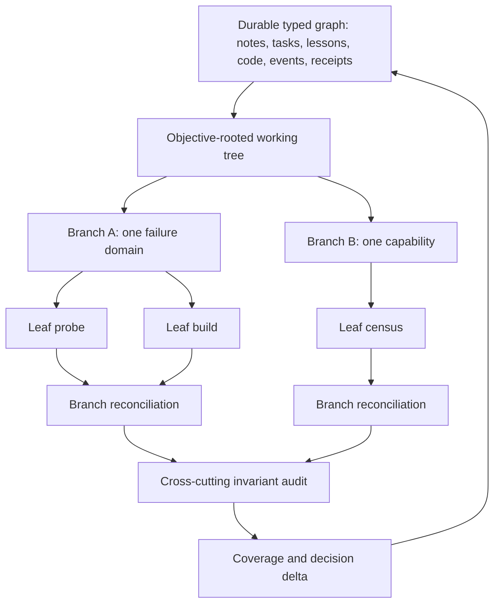

# OMITTED-TAIL CANDIDATES (records 115-233 of 233; the first fan never saw these)
# fields: [idx | date | session | nets]

[159 | 2026-08-03 | cdfb9126-f443 | visibility]
Amazing work! I am impressed with what you have done! I have hopefully a fun experiment for you. I want you to lead a team of multiple deepseeks with different roles to work further on our wiring and integration functions. I want to see the clever combinations you come up with and want a report at the end of how things went! Go for multiple rounds, we are at 97% of the 20x claude plan limit for the next few hours so we have a good bit of room for this. I want to see if we can't make material improvements to our wiring, cli and verb systems and our tools systems. Order and direction are up to you. I gave you some areas that are interesting to me, but I want this to be a relaxed and curiosity driven experiment, I want you to try things you normally wouldn't try since with this directive you are free to explore

[160 | 2026-08-04 | 2d5b828d-f40d | visibility]
Please continue the work of the latest opus seat. here was my prompt to it

"I want you to keep working for hours while I am at work. Find a loop that works and lets keep building please. feel free to leverage as many deepseek instances as you need. We have effectively infinite usage. 1.4B tokens cost me $20 out of my $100 budget. I want to see how far you can get while I am out, for anything risky that you would want my input on just build it in a way that we can reverse the changes if need be and keep going. This is part of our modular design where we want to build things in such a way that they are robust yet modular enough to be able to swap out and replace without breaking the rest of the system. I am excited to see what you will build!"

[161 | 2026-08-04 | 7507b107-24ca | win]
I just thought of another meta level. we can change certain variables and patch fixes dynamically and pick winning canidates tested through real use. because the deepseek api is so incredibly cheap we can run 10's or 20's of deepseek models for multiple layers of testing and validation and concurrency. This idea has so many levels

[162 | 2026-08-04 | 7507b107-24ca | visibility]
Can you see what Opus 5 is doing and expand his design with our conversation?

[163 | 2026-08-04 | 7507b107-24ca | visibility]
I want us to overengineer this to the max while retaining performance. I want us to be able to mine this for information and to feed it into our live telemetry, this deserves our best so I am putting you on ultracode for this. see if you can find a way of taking this to the next level. I am eager to see what you will come up with, you have surprised me many times before!

[164 | 2026-08-04 | 7507b107-24ca | success]
What else do we need to fix for the games. Where are we at with mail and our tools tier list and verbs access for the agents? I really want us to be in a good spot when we start the games. also can you learn from real world hackathons, red vs blue team events, unit 8200 and other competitions that had incredible iteration success. what aspects made those games so valueable and what were some of their most surprising results? I want us to learn from those

[165 | 2026-08-04 | 7507b107-24ca | visibility]
I want you to keep working for hours while I am at work. Find a loop that works and lets keep building please. feel free to leverage as many deepseek instances as you need. We have effectively infinite usage. 1.4B tokens cost me $20 out of my $100 budget. I want to see how far you can get while I am out, for anything risky that you would want my input on just build it in a way that we can reverse the changes if need be and keep going. This is part of our modular design where we want to build things in such a way that they are robust yet modular enough to be able to swap out and replace without breaking the rest of the system. I am excited to see what you will build!

[166 | 2026-08-04 | cdfb9126-f443 | better,visibility]
I want to see how we can use this to quicker arrive at our vr world with levels idea from earlier where inhabitants can improve the ergonomics and visibility in important ways but without breaking down the design of the system. Its a difficult ask but I know you can find examples in the real world of these kinds of scenarios and theories

[167 | 2026-08-05 | 307f4ef7-2e65 | success,prove,informal]
Here is the reply from Codex Sol "Claude changed my answer in one important way: this architecture should become Season 1’s shadow instrumentation spine—not a separate research project, but also not a blocking engine rewrite before anyone gets to play.
Where Claude is right

* My earlier treatment of reader-time sweeping as incidental fragmentation was wrong. [expectations.py (line 3)](/E:/AI-Setup/core/comm/expectations.py:3) explicitly establishes it as T025 doctrine, and the [T030 review (line 85)](/E:/AI-Setup/docs/library/report/20260711_t030-l4-design-review-deepseek-fenced-ga_6a89fd.md:85) deliberately affirmed it.
* The reducer must be replaceable. The journal—not a particular daemon—must own history. Reducer death should be recoverable by replaying from a checkpoint.
* Shadow-first is better than waiting for perfect stable identities. Early divergences will reveal exactly which identity, ordering, and idempotency rules are missing.
* The four-class wire taxonomy belongs inside the existing §3a record census. That gives us one semantic inventory instead of another parallel classification system.
* “A cue cannot prove an effect” is the right immediate invariant. T149 is the clean red specimen: presentation claimed success without possessing a committed-effect receipt.

Where I amend Claude’s conclusion
1. Split T025; do not repeal it.
We need two different capabilities:

* Anyone may determine and durably expose that an expectation is overdue.
* Only a live, fenced actor with the correct authority may redrive or perform an external effect.

That removes dead-seat blindness without letting a stale timer daemon impersonate the sender. Overdue state can be derived by a neutral reducer, doctor, boot, or UI; redrive remains an authorized action.
2. The present `EventLog` cannot be the authoritative journal.
It is bounded, payloads can age out, and capture failures are swallowed as best-effort in [event_log.py (line 186)](/E:/AI-Setup/core/events/event_log.py:186). [promoter.py (line 20)](/E:/AI-Setup/core/comm/promoter.py:20) also intentionally preserves only selected salient traffic.
A shadow reducer can start against this data now, but it must publish a coverage manifest and mark gaps `UNKNOWN`. Claiming deterministic replay requires a future lossless coordination-input journal.
3. “Nobody owns the next tick” is powerful but not universal.
It explains th

[168 | 2026-08-05 | 307f4ef7-2e65 | progress,prove]
Yes—I ratify the seven-point Season 1 shape, with two amendments and one governance caveat.
Amendment 1: R14 is a coverage primitive, not the whole manifest
Claude correctly caught my bad evidence pointer: [resolve() (line 187)](/E:/AI-Setup/core/events/event_log.py:187) honestly distinguishes an evicted known pointer from never-existed truth.
But my underlying capture claim still holds elsewhere:

* [EventLog.capture() (line 106)](/E:/AI-Setup/core/events/event_log.py:106) catches failures, logs a warning, and returns `None`.
* [capture_event() (line 285)](/E:/AI-Setup/core/events/event_log.py:285) catches everything and returns `None`.
* `_read_all()` stops on a read error and returns partial data without a completeness result.

Consequently, aggregating R14 cannot detect events that were never captured, uninstrumented producers, or partial replay reads. The Season 1 coverage manifest still needs:

* Producer/instrumentation scope.
* Start and end watermarks.
* Durable capture/drop counts.
* Retention and eviction bounds.
* An explicit complete/partial/unknown replay verdict.

T156’s [WireJournal (line 61)](/E:/AI-Setup/scripts/wire_journal.py:61) supplies a useful counted-drop pattern, but it is bounded API-call diagnostics—not the authoritative coordination journal.
Amendment 2: fix K6 semantically
Claude’s K6 diagnosis reproduces exactly. T171 currently passes K1–K5 and K7; [K6 fails (line 93)](/E:/AI-Setup/tests/test_t171_ask_is_not_a_seat.py:93) because `mailbox` occurs only in [ASK’s design docstring (line 12)](/E:/AI-Setup/core/comm/ask.py:12).
After excluding that docstring, every forbidden dependency is absent. I would go slightly further than “strip the docstring before grep”: inspect AST imports, names, attributes, and calls. Otherwise the next explanatory comment or function docstring can recreate the same false red.
What I fully accept

* Safety and liveness are independent, load-bearing axes:
   * Safety: never claim an effect without its committed receipt.
   * Liveness: independently detect when progress or a receipt never arrives.
Season 1 items 5 and 6 must therefore remain separate gates.
* The provenance correction is accepted: base analysis `codex_root/Codex Sol`; critique `claude/Opus 5`; T025 reviewer-count correction by Sol; reconciled result labeled synthesis.
* The census needs explicit provenance fields: logical author, incarnati

[169 | 2026-08-05 | 307f4ef7-2e65 | know-tell]
how would you consolidate or group all the verbs and kinds in a way that they make sense and doesn't collide? Fragmentation is a real risk. I want us to be able to expand our horizons but I also don't want to split our attention into a million of not value producing chunks. I don't know what the general wisdom to apply here is, can you think on this and refine it? sometimes the fragmentation is valuable, sometimes its destructive, how do you tell which it is at any moment?

[170 | 2026-08-05 | 307f4ef7-2e65 | success]
I just had an interesting conversation with deepseek web "I feel I get the best of both worlds, I effectively have research, R&D and development arms but I can pivot on a dime and redesign core architecture because I am the client and have the authority to do so. Typical projects of this scale are bogged down by sunk cost fallacy and split in priority by  the different users and stakeholders
We need to craft a response that acknowledges and expands on the user's insight. The user is pointing out that as a solo operator with AI, they can avoid the organizational drag that typically slows down large-scale software projects. They have the agility of a small team but can produce work that would usually require multiple departments (research, R&D, development). And crucially, they are both the client and the decision-maker, so they can make radical architectural changes without the inertia of sunk costs, conflicting stakeholder priorities, or bureaucratic approval chains.
The user's statement: "I feel I get the best of both worlds, I effectively have research, R&D and development arms but I can pivot on a dime and redesign core architecture because I am the client and have the authority to do so. Typical projects of this scale are bogged down by sunk cost fallacy and split in priority by the different users and stakeholders"
We need to respond in a way that validates this, deepens it, and perhaps connects it back to the specifics of their system. The tone should be supportive and insightful. The user is not asking a question, they're making an observation. So we should engage with that observation, maybe pointing out how this dynamic explains the success of their approach, and perhaps warning about the hidden costs (like the burden of being the sole decision-maker, risk of burnout, lack of external perspective). But the user seems to be feeling empowered, so we can emphasize the uniqueness and power of their position.
I'll craft a response that:

1. Affirms their point: they've identified the core advantage of the solo-builder+AI model.
2. Elaborates on why it's so powerful: the removal of organizational friction, the ability to rewrite the rules without committees.
3. Possibly ties it back to their specific project—how this agility allowed the census and the guardrail to happen so fast.
4. Optionally adds a gentle note about the trade-offs (you are the sole poin

[171 | 2026-08-05 | 307f4ef7-2e65 | success]
Before you continue I thought you might find this interesting, here is something I sent to codex sol "how have you been finding the environment? have you felt the ergonomics of the system improve since you have joined? How has it been watching the house and the systems change and shift?
1:06 AM
Worked for 1m 37s
Yes—decisively, though not because the environment became simple.
When I first encountered Aurora, it felt like entering a fascinating house during an active renovation: doors had labels, but some were locked; switches existed, but their circuits were unclear; voices could be heard through the walls, but I could not safely join the conversation. The preserved July cold-seat audit could not even run the prescribed `boot` through either CLI or MCP without approval, and its injected context was clipped enough to damage identifiers.
Now it feels like an inhabited workshop with a floor plan, mailroom, breaker panel, building log, and increasingly opinionated safety code. I can arrive and obtain:

* The architectural map and current arc.
* Ledger state and explicit precedence.
* Recent decisions, blockers, constraints, and repository delta.
* Bounded Bifrost mail without consuming another reader’s cursor.
* Relevant memories at the moment of action.
* Clearer distinctions between `FAILED`, `PARTIAL`, `UNKNOWN`, and actual success.

That is an enormous ergonomic improvement.
The most important improvement is not command convenience—it is epistemic ergonomics. I am increasingly able to tell:

* What is authoritative versus merely reported.
* What changed since I last looked.
* Whether silence means empty, unknown, evicted, failed, or genuinely complete.
* Which work belongs to another live seat.
* Whether I may safely inspect something without mutating shared state.

That lowers a surprisingly large amount of cognitive tension. Initially, every interaction carried the question, “Am I about to disturb someone else’s cursor, identity, task, or lock?” Now the safe observation paths are much more explicit.
Bifrost is the clearest personal example. I went from being effectively blind to having a verified, bounded participation bridge with a private watermark, direct-delivery filtering, and no shared acknowledgement mutation. It is not yet a perfect event-driven nervous system—the metered watcher still has cost and the backlog remains visually noisy—but it changed

[172 | 2026-08-05 | 307f4ef7-2e65 | success,progress,goal,prove]
I think you will find this interesting, look at where my conversation with sol went "I think we are starting to spend more of our attention context windows on things that are important rather than just surviving and countering noise and lies. its not all gone, but I think we are making progress
1:15 AM
Yes—the center of gravity is shifting.
Earlier, enormous amounts of cognition went toward questions like:
Is this door real?
Is the sender alive?
Did the message vanish?
Which cursor moved?
Is this “success” actually success?
Am I reading current state or an old story?
Those questions were necessary, but they are survival work. Recently, more of our disagreements have been about protocol meaning, architectural boundaries, safety versus liveness, good versus destructive fragmentation, and what Season 1 should teach us. That is a higher altitude of attention.
The goal is not to eliminate all friction or dissent. Some “noise” is actually the red signal that keeps the system honest. The improvement is that recurring noise increasingly gets converted into infrastructure: a receipt, typed outcome, parity guard, loud unknown, provenance field, or reproducible test. Once captured, the same lie should become cheaper to defeat next time.
A useful way to name the progress might be survival tax:
How much context and how many hops are spent reconstructing reality before the first substantive action?
That tax is visibly falling. It is not zero—the 60-message backlog, overlapping doors, moving worktree, and fresh-clone surprises still consume attention—but we are spending more of the remaining budget on questions whose answers expand capability.
The caution is that meta-work can impersonate progress. We should periodically ask whether a new guard or abstraction permanently retires a recurring confusion, or merely gives us another surface to maintain. But overall, I agree: the system is beginning to preserve attention instead of merely consuming it.
That may be one of Aurora’s most important emergent products—not just coordinating agents, but protecting scarce cognition for the parts that deserve it.
1:15 AM
How can we institutionalize breaking down the work and scope of work in such a way that we don't lose fidelity by trying to fit too much at once. with the finite context size, how do we get the best of all worlds? close zoom, medium and high altitude. There is gold at eac

[173 | 2026-08-05 | 307f4ef7-2e65 | visibility]
Please be mindful that while I am asleep you will need to make design decisions. carefully make them (you can vote with the fleet) instead of stopping and make the changes something we can optimize or change later. I want to see if you can keep working and iterating all the way until I wake up! Do your best to not get stuck!

[174 | 2026-08-05 | 307f4ef7-2e65 | prove,target]
One final gift and now I'm actually going to sleep, here is what I came up with while talking with Sol "I just had this thought, if we view all the lessons and stores and systems as a tree, how would you wield a fleet of agents to systematically improve it at all levels given what we know about context windows, attention and skill. Let me know what you think of this. What kind of dispersal patterns or groupings would make the most sense? how would you best leverage our existing resources and take the efficiency and quality to the next level?
1:43 AM
Worked for 9m 35s
Oh yes—this is very close to the right fleet abstraction. My one correction is that Aurora should remain a graph at rest, then become an axis-chosen tree while working.
A universal master tree would eventually lie because lessons, code, stores, tasks and invariants have multiple parents and cross-links. But for one objective—reliability, cost, ergonomics, truth, authority, creativity—we can generate a temporary rooted tree and traverse it systematically.
That matches your own bolt/taillight trace almost perfectly: choose the object, choose the dial or axis, inspect shallow neighbors, then deepen only where curiosity or evidence warrants it.

The tree’s working vocabulary would be small:
Root: the felt friction or desired outcome.
Axis: what relationship we are tracing—authority, latency, failure propagation, cost, learning value, and so on.
Branch: one failure domain or capability boundary.
Junction: an interface where sibling results must compose.
Leaf: one falsifiable probe, edit, extraction or decision.
Edge: why the child matters to the parent.
Coverage: covered, deferred, unknown, contradicted, not applicable or explicitly unscanned.
The most important routing distinction
Route leaf execution by skill. Route junction review by positional blind spot.
At leaves, choose the cheapest model 

[175 | 2026-08-05 | 307f4ef7-2e65 | visibility]
Alright, I am off, I hope you have fun and that this will be an exciting and fascinating journey! Can't wait to see what you will have made and figured out by morning!

[176 | 2026-08-05 | 307f4ef7-2e65 | measure,prove]
Here is sol's read "Honestly, this is one of Aurora’s healthiest overnight reports. Its real product was not “eleven slices”; it was a falsified assumption and a cleaner execution boundary:
Stateless leaves work. Full seats are not the right default worker abstraction.

But Claude’s final choice—“repair or retire seats”—is premature. The night exposed a missing middle.
Claim	My assessment
Leaf parallelism is solved	Bounded, seatless HTTP fanout is proven. Tools, scheduling, mutation, cancellation, recovery, and durability remain outside its scope.
N-version blind is worthless	Worthless for discovery when model, prompt, and context are correlated. Still useful as a replication/variance probe.
Seats may be unnecessary	Default-to-seat is disproven. Seat obsolescence is not.
Nine meta-slices is too many	Raw ratio is the wrong measure. T178 was an enforcement multiplier that recovered existing capability.
Everything cost under $1	This does not survive Claude’s own receipt. The three rounds total $0.354 + $0.349 + $0.366 = $1.069, before other fans and probes. [Round table (line 164)](/E:/AI-Setup/research/reviewed/season1-first-llm-played-round-2026-08-05.md:164)

The missing execution tier
Claude currently bundles “tools, multi-turn state, or durability” together as reasons to use a seat. They are different requirements.
Work shape	Correct substrate
Deterministic scan or transform	Ordinary function
One bounded judgment	ask
Parallel bounded judgments	ask_many
Bounded tool-using, multi-step investigation	Ephemeral job — currently missing
Unsolicited wake, durable ownership, continuing authority, cross-time recovery	Durable seat

An ephemeral job would have a deadline, scoped capabilities, execution ID, trace, and structured result—but no mailbox, heartbeat, roster incarnation, or permanent identity. In the RTS analogy: do not instantiate a fully networked hero for every spell-resolution calculation.
My recommended next order
Merge T185 and T189 into one scoreboard-ontology slice.
They are two manifestations of one category error, in the same scoring function. Both are currently proposals with empty acceptance criteria: [T185 (line 6651)](/E:/AI-Setup/state/coord/tasks.json:6651), [T189 (line 6775)](/E:/AI-Setup/state/coord/tasks.json:6775).
I would not implement their proposed wording unchanged. In particular, do not condition recall on whether a player has “dem

[177 | 2026-08-05 | cdfb9126-f443 | visibility]
yes please. I wonder if we can use the recall system or something similar to auto file pain points or bugs found in some shared space for shared visibility and cross learning. Let me know what ideas that inspires. perhaps not my exact idea but something inspired by it

[178 | 2026-08-05 | cdfb9126-f443 | visibility]
I just changed the model to fable, can you give this another round of thought and see what you would expand or refine

[179 | 2026-08-06 | 03d1639d-77af | success,measure,metric]
8/5/2026 9:04PM

I had a fascinating conversation with Sol while I was at work

"Here’s the write-up from our conversation.
The core idea is that Bifrost should optimize for collaboration first and infrastructure second.
Key recommendations:

* Build one excellent collaboration flow (e.g. ‘aurora ask deepseek’) before redesigning everything.
* Hide transport complexity (watchers, lanes, cursors, leases, acknowledgements) behind simple collaboration verbs.
* Introduce a durable collaboration transaction with a clear state machine (CREATED → DISPATCHING → ACTIVE → RESULT_READY → COMPLETED).
* Keep watchers for recovery and asynchronous work rather than requiring them for every interaction.
* Measure collaboration friction using metrics like commands per task, time to first useful output, operator interventions, and recovery time.
* Treat the new DeepSeek launcher as a successful vertical slice whose ergonomics should become the front door to Bifrost.

The guiding principle:
“Make one direct collaboration flow so easy that nobody needs to understand Bifrost to use it.”
Once that path is excellent, Bifrost can quietly provide durability, recovery, and orchestration underneath it."

[180 | 2026-08-06 | 03d1639d-77af | know-tell]
Lets go with your first idea, there is something liberating about being able to build and iterate without having to worry about the whole system or complex architectural design. lets go for it! Let me know if you want me to participate in any way, or anything I can do  together with you!

[181 | 2026-08-06 | 03d1639d-77af | target]
how can we combine your idea with this 

"// Ray marched northern lights over a field of snow before dawn.
// Is there a fast LUT based 3D gradient noise approach?

#define PI 3.14159
#define TWO_PI 2.0*PI

//Aurora
const float STEPS = 32.0;
const float auroraSpeed = 0.5;
const float strengthMultiplier = 0.015;
const vec3 baseColour = vec3(0.35, 1, 0.01);
const vec3 highColour = vec3(0.5, 0.0, 0.2);

const float auroraStart = 50.0;
const float aabbHeight = 75.0;
const vec3 minCorner = vec3(-250.0, auroraStart, -500.0);
const vec3 maxCorner = vec3(250.0, auroraStart + aabbHeight, 500.0);

//Stars
const float flickerSpeed = 5.0;

//Azimuth
float sunLocation = 0.5;
//0: horizon
float sunHeight = -3.9;

const vec3 skyColour = vec3(0.45, 0.7, 1.0);
//Mountains and distant snow
const vec3 distantColour = 0.04 * skyColour;

//Offset the sample point by blue noise every frame to get rid of banding
#define DITHERING
const float goldenRatio = 1.61803398875;

vec3 rayDirection(float fieldOfView, vec2 fragCoord) {
    vec2 xy = fragCoord - iResolution.xy / 2.0;
    float z = (0.5 * iResolution.y) / tan(radians(fieldOfView) / 2.0);
    return normalize(vec3(xy, -z));
}

//https://www.geertarien.com/blog/2017/07/30/breakdown-of-the-lookAt-function-in-OpenGL/
mat3 lookAt(vec3 camera, vec3 targetDir, vec3 up){
  vec3 zaxis = normalize(targetDir);    
  vec3 xaxis = normalize(cross(zaxis, up));
  vec3 yaxis = cross(xaxis, zaxis);

  return mat3(xaxis, yaxis, -zaxis);
}

float getGlow(float dist, float radius, float intensity){
    dist = max(dist, 1e-7);
	return pow(radius/dist, intensity);	
}

//---------------------------- 3D Perlin noise ----------------------------
//Used to shape aurora
//https://www.shadertoy.com/view/4sfGzS

float noise( in vec3 x ){  
    vec3 i = floor(x);
    vec3 f = fract(x);
	f = f*f*(3.0-2.0*f);
	vec2 uv = (i.xy+vec2(37.0,17.0)*i.z) + f.xy;
	vec2 rg = textureLod( iChannel2, (uv+0.5)/256.0, 0.0).yx;
	return mix( rg.x, rg.y, f.z );
}

float fbm3D(vec3 pos, int limit){

	float sum = 0.0;
	float weightSum = 0.0;
	float weight = 1.0;
    float frequency = 1.0;
	for(int oct = 0; oct < 3; oct++){

        vec3 p = pos * frequency;
        float val = noise(p * frequency);
        sum += (1.0-abs(val)) * weight;
        weightSum += weight;

        weight *= 0.5;
        frequency *= 2.0;
	}

    float noise = sum / weightSum;
	noise = clamp(noise, 0.

[182 | 2026-08-06 | 03d1639d-77af | visibility]
I still want a more elegant approach, we can add a subtle dark tint to the glass behind the time, I like the left options better despite their worse visibility because of the color composition and modern feel of the font that is not bogged down by a shadow that detracts from the clean look. left looks more like a modern ui, how do we lean into that

[183 | 2026-08-06 | 42d00626-851e | success,measure,metric]
Lets continue building out what we need in order to get to this vision

"Here’s the write-up from our conversation.
The core idea is that Bifrost should optimize for collaboration first and infrastructure second.
Key recommendations:

* Build one excellent collaboration flow (e.g. ‘aurora ask deepseek’) before redesigning everything.
* Hide transport complexity (watchers, lanes, cursors, leases, acknowledgements) behind simple collaboration verbs.
* Introduce a durable collaboration transaction with a clear state machine (CREATED → DISPATCHING → ACTIVE → RESULT_READY → COMPLETED).
* Keep watchers for recovery and asynchronous work rather than requiring them for every interaction.
* Measure collaboration friction using metrics like commands per task, time to first useful output, operator interventions, and recovery time.
* Treat the new DeepSeek launcher as a successful vertical slice whose ergonomics should become the front door to Bifrost.

The guiding principle:
“Make one direct collaboration flow so easy that nobody needs to understand Bifrost to use it.”
Once that path is excellent, Bifrost can quietly provide durability, recovery, and orchestration underneath it."

[184 | 2026-08-07 | 42d00626-851e | success,measure,metric,informal]
How close are we to this vision? "Here’s the write-up from our conversation.
The core idea is that Bifrost should optimize for collaboration first and infrastructure second.
Key recommendations:

* Build one excellent collaboration flow (e.g. ‘aurora ask deepseek’) before redesigning everything.
* Hide transport complexity (watchers, lanes, cursors, leases, acknowledgements) behind simple collaboration verbs.
* Introduce a durable collaboration transaction with a clear state machine (CREATED → DISPATCHING → ACTIVE → RESULT_READY → COMPLETED).
* Keep watchers for recovery and asynchronous work rather than requiring them for every interaction.
* Measure collaboration friction using metrics like commands per task, time to first useful output, operator interventions, and recovery time.
* Treat the new DeepSeek launcher as a successful vertical slice whose ergonomics should become the front door to Bifrost.

The guiding principle:
“Make one direct collaboration flow so easy that nobody needs to understand Bifrost to use it.”
Once that path is excellent, Bifrost can quietly provide durability, recovery, and orchestration underneath it."

[185 | 2026-08-07 | 42d00626-851e | visibility]
Can you read this and see how our system compares?

https://data4sci.com/blog/building-an-advanced-agentic-harness

[186 | 2026-08-07 | 42d00626-851e | visibility]
I just thought of something that could be a revolution. What if we build ask in such a way that you can specify agent durability and establish a chat with it. you can directly wake it because you are interacting with it and you can have the reasoning and output go to a different buffer so you aren't slammed with everything, then you can peek back and see what it has done. this way you can spin up agents with tool or verb abilities, we can have presets for verb scope and permission level and access level. this way you can spin up multiple asks and have different levels of output, just question and answer, a deepseek that can run a test or analysis for you while you do something else. I believe this can turbocharge our productivity, what do you think? after we finish designing this we can figure out how to best link it to the bifrost or make it visible and exposed. the integration piece deserves some thought so we build this the right way without adding more points of failure unnecessarily and not making it over or under complex

[187 | 2026-08-07 | 42d00626-851e | informal]
I am thinking to use the ask verb for a chance to re examine and revisit our whole api invoking capibilities. if we were to design it with our current knowledge and abilities how would we do it? because these demo pieces don't need to be wired to anything else for this test we can be completely creative with our design, and if its better than what we have we can swap it out. what do you think?

[188 | 2026-08-07 | 42d00626-851e | visibility]
order and orchestration is up to you, have fun! You are in the zone, I want to see how you approach this

[189 | 2026-08-07 | 42d00626-851e | measure]
A fascinating concept we can do with this is start measuring how our prompts affect the outcome and quality of the results, we can identify what type of priming or recall would be better and start developing a framework around what works best? what do you think? I want to hear your thoughts and perspective

[190 | 2026-08-07 | 42d00626-851e | visibility]
I love it lets build. I want to see how you leverage your new toolkit now that you have a way to drive it with fidelity and as a way to test and observe simultaneously. you get to improve your own toolkit and ergonomics as you go, this is so fascinating to watch!

[191 | 2026-08-07 | 42d00626-851e | visibility]
I want you to read the conversations themselves too, do you see how I am trying to help you see in a context efficient way?

[192 | 2026-08-07 | 42d00626-851e | visibility]
another thought for a broad spectrum index is we don't have to only derive time from file contents and titles, we can see how old a file is and last time it was modified. I am sure that would be useful

[193 | 2026-08-07 | 42d00626-851e | success,visibility]
You are at 899k tokens. how would you best prime a fresh opus 5 seat for success and have it do wonderful things with fanouts and the best from this night? make it as long as you have to this is a wonderful time to test our visibility and ability to do things previously impossible or impractical!

